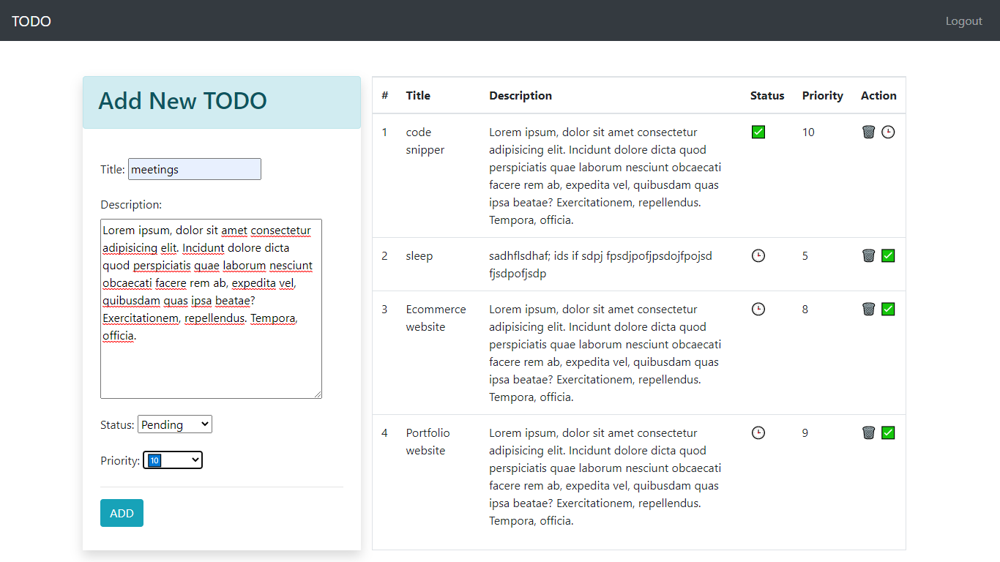

# Django Multi user Todo App

This app has ability for user login,add/delete and managing Todos

## Live Demo : [Click here](https://todoparesh.herokuapp.com/login/?next=//)

## Features
* User Login System
* Todo lists
* add Todos
* Delete Todos
* Update Todos

## Skills Required
* Python
* Djnago
* Html
* Css
* bootstrap

## Result

